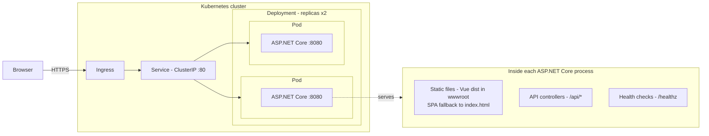
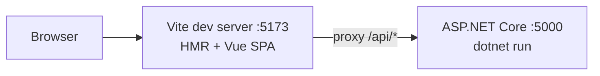
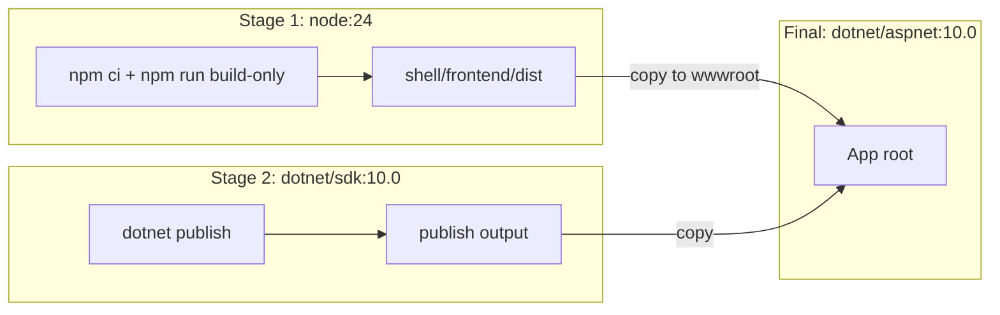

# 001 — Initial Architecture

Date: 2026-08-05
Related ADRs: [0001](../adr/0001-vue3-vite-frontend.md), [0002](../adr/0002-dotnet10-lts-backend.md), [0003](../adr/0003-single-container-serving.md), [0004](../adr/0004-controllers-api-style.md)

## Overview

A single-service web application: an ASP.NET Core (.NET 10) process serves both the REST API (controller-based, under `/api/*`) and the production build of the Vue 3 SPA (static files with an `index.html` fallback for client-side routing). One container image, deployed to Kubernetes with basic objects via Helm.

## Runtime architecture (production / Kubernetes)

The Deployment's liveness and readiness probes hit `/healthz`. The Ingress is optional (`ingress.enabled` in `helm/extensions/values.yaml`); without it the Service can be reached via port-forward or a LoadBalancer type.

## Development-time architecture

In dev the SPA is served by Vite (hot module reload); only `/api/*` calls reach the backend. This keeps the single-container decision invisible to day-to-day frontend work.

## Docker image build

The final image contains only the ASP.NET Core runtime, the published app, and the SPA assets — no Node, no SDK.

## Conventions for this folder

Each significant architecture change gets a new numbered file (`002-…`, `003-…`) with updated mermaid diagrams and an explanation of what changed and why, referencing the ADR that motivated it. Older files are kept as history.
