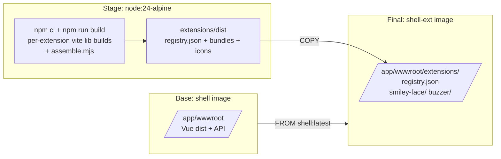
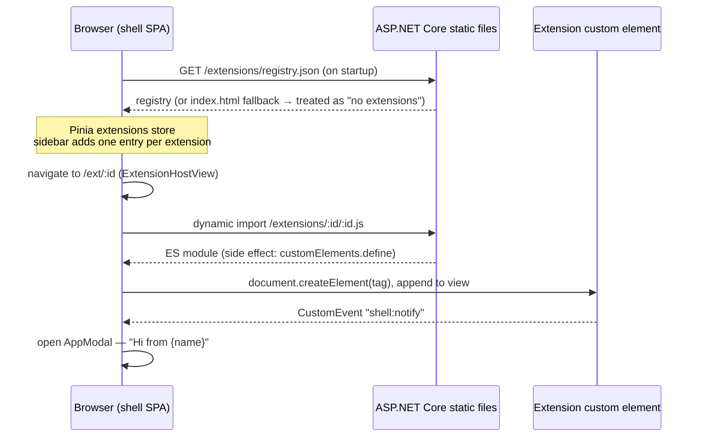
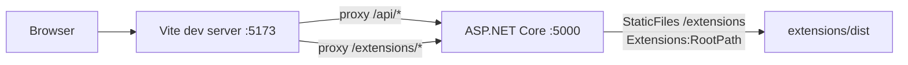

# 002 — Extension System

Date: 2026-08-05
Related ADRs: [0006](../adr/0006-web-component-extension-system.md)
Previous snapshot: [001](./001-initial-architecture.md)

## What changed

The shell now supports UI extensions: self-contained web components (custom elements) built outside the shell codebase, served as static assets under `/extensions/`, discovered at startup via a static `registry.json`, listed in the sidebar, and rendered at `/ext/:id`. Extensions communicate with the shell via DOM `CustomEvent`s. Extensions ship in a second Docker image layered on the shell image, so they deploy independently of the shell.

## Image layering

The shell image (`Dockerfile`) is unchanged and still runs standalone — with no `/extensions` files installed, the registry fetch soft-fails and the sidebar shows only the built-in tools. `Dockerfile.extensions` builds the `extensions/` npm workspace and copies `extensions/dist/` into `wwwroot/extensions/`; everything else (entrypoint, port, user, probes) is inherited.

## Runtime flow

## Extension contract

- **Manifest** (`extensions/<id>/extension.json`): `{ id, name, tag }`; `id` equals the folder name, `tag` starts with `ext-`. `assemble.mjs` validates both and fails the build on duplicates.
- **Registry** (`/extensions/registry.json`, built artifact): `{ "extensions": [{ id, name, tag, module, icon }] }` with `module`/`icon` URLs under `/extensions/<id>/`.
- **Events**: extensions dispatch `CustomEvent`s on their own host element; the shell listens on the element it created. Current events: `shell:notify` → shell shows a modal with the extension's name.

## Development-time architecture

`Extensions:RootPath` (set only in `appsettings.Development.json`) points the backend at `extensions/dist`; the mapping is skipped when the key is absent or the folder does not exist, so production and the no-extensions case need no configuration. Rebuild extensions with `npm run build` in `extensions/` to see changes (no HMR for extension bundles).
