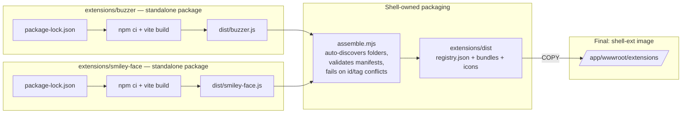

# 003 — Independent Extension Builds

Date: 2026-08-06
Related ADRs: [0006](../adr/0006-web-component-extension-system.md), [0007](../adr/0007-independent-extension-builds.md)
Previous snapshot: [002](./002-extension-system.md)

## What changed

Build and packaging only; the runtime flow, registry contract, and development serving model are unchanged from [snapshot 002](./002-extension-system.md). The `extensions/` npm workspace is gone: each extension is now a standalone npm package with its own committed `package-lock.json` and its own `node_modules`, built in isolation by `npm ci && npm run build` inside its folder. No extension knows about any other extension; the shell's tooling (`build-all.mjs`, `assemble.mjs`, `Dockerfile.extensions`) is the only party that sees the installed set, and it discovers extensions automatically — adding one is adding a folder, with no workspace entry or Dockerfile edit.

## Build and packaging flow

Each extension's build sees only its own folder — no shared lockfile, no hoisted dependencies, no sibling extensions. `extensions/scripts/build-all.mjs` is a shell-owned convenience that runs the per-extension builds sequentially and then the assembler; `Dockerfile.extensions` copies `extensions/` wholesale and runs it (`node scripts/build-all.mjs`), so the image build needs no per-extension COPY list. The `id`/`tag` uniqueness check in `assemble.mjs` is a packaging-time conflict resolved by the deployer, not coordinated between extension authors.

## Development loop

Build inside the extension's folder (`npm ci && npm run build`), then run `node scripts/assemble.mjs` from `extensions/` — or `node scripts/build-all.mjs` to do everything. The backend still serves `extensions/dist` at `/extensions` via `Extensions:RootPath` in Development, exactly as in snapshot 002; there is no HMR for extension bundles.
