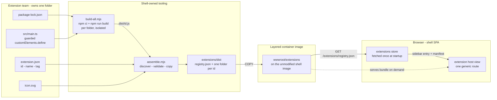
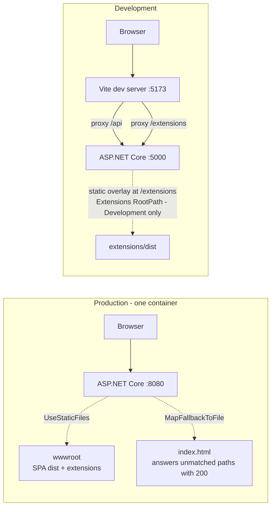
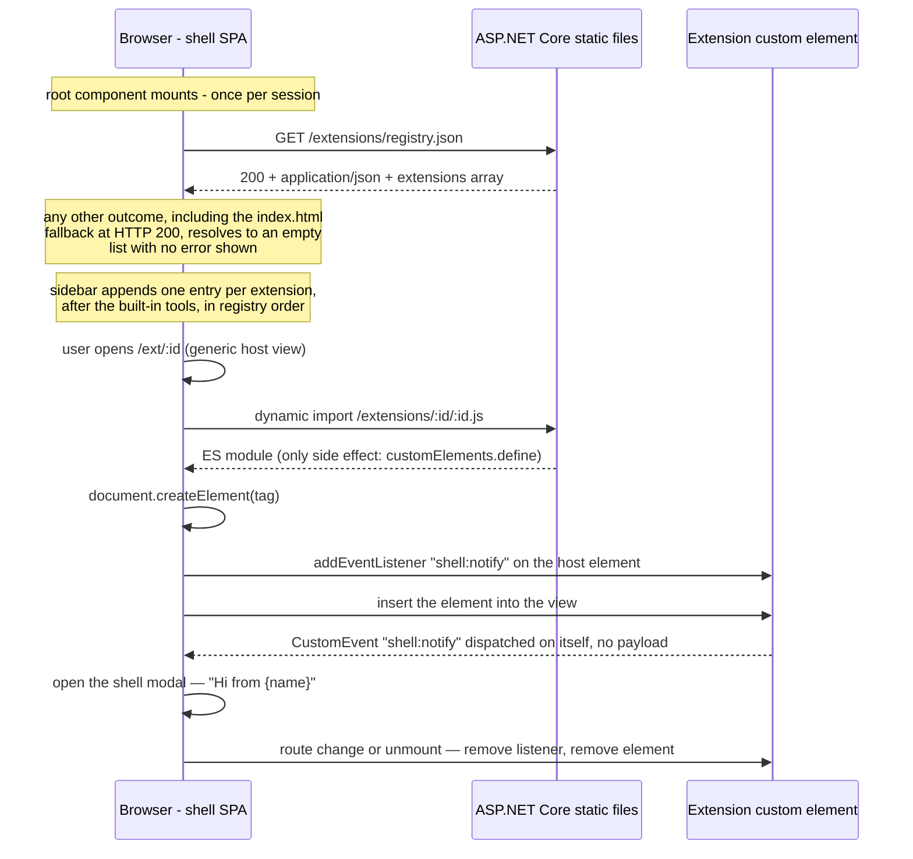
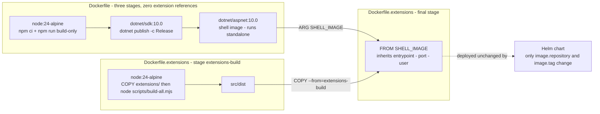
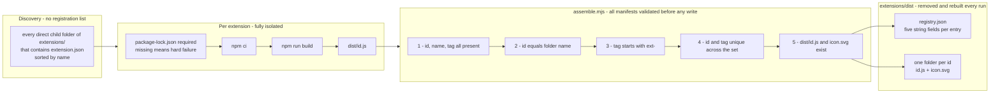

# 004 — Extension Platform

Date: 2026-08-10
Audience: Shell maintainers, extension authors, platform and deployment teams
Related ADRs: [0006](../adr/0006-web-component-extension-system.md), [0007](../adr/0007-independent-extension-builds.md)
Related standards: [STD 001 v1.1.0](../standards/001-extension-consumption.md), [STD 002 v2.0.0](../standards/002-extension-authoring-and-communication.md)
Previous snapshot: [003](./003-independent-extension-builds.md)

## Overview

The shell is a single-container web application — a Vue 3 single-page app served by an ASP.NET Core backend — that hosts UI extensions written and deployed by other teams. An extension is a self-contained custom element: one folder, built independently into one JavaScript file, discovered by convention, served as a static asset, and mounted into a generic host view when a user navigates to it. The shell does not compile, import, or link extension code, and no extension imports shell code.

This snapshot is a consolidation. It restates the runtime model from [snapshot 002](./002-extension-system.md), the build and packaging model from [snapshot 003](./003-independent-extension-builds.md), and the full normative text of both extension standards, so that a team can adopt the platform without access to this repository. It is substantially longer than snapshots 001–003 for that reason; the earlier snapshots remain unchanged as history, and this document supersedes neither.

**Platform invariants.** Everything else in this document is the proof of these six.

1. **Static files only.** No API controller, route, or middleware participates in extension discovery or delivery (`CONSUMPTION-01`).
2. **Discovery is by convention.** A folder containing an `extension.json` is an extension. There is no registration list, manifest index, or allowlist anywhere in the repository.
3. **Zero extensions is a normal state.** Every discovery failure resolves silently to an empty list, and the shell shows the user no error (`CONSUMPTION-07`).
4. **One event, one direction.** The entire runtime channel is a single DOM event, `shell:notify`, dispatched by the extension on its own host element (`EXT-16`, `EXT-17`, `EXT-18`).
5. **Extensions ship as a layer.** They are copied onto the unmodified shell image; deploying them changes `image.repository` and `image.tag` and nothing else (`CONSUMPTION-15`).
6. **No extension is aware of any other.** The shell is the only party that knows the installed set (`EXT-21`, `EXT-22`).

## Scope, authority, and terms

This document covers both sides of the contract: how the shell discovers, serves, and runs extensions (Part A), and how extensions are packaged and built (Part B). Read Part A first even if you only intend to author extensions. Nearly every packaging constraint in Part B is downstream of a serving decision in Part A — the fixed bundle filename exists because registry URLs are synthesized, `icon.svg` sits at the folder root because it is copied verbatim, the `ext-` prefix exists because custom-element registration is global to the page, and bundles carry their own framework because nothing is shared between them at runtime.

**Authority.** This snapshot restates the normative rules of STD 001 — Extension Consumption by the Shell (v1.1.0) and STD 002 — Extension Authoring and Shell Communication (v2.0.0) in full, so that it can be read without access to the repository. The duplication is deliberate. **Where this document and a standard disagree, the standard is correct and this document is wrong** — treat the difference as a defect in this snapshot, not as a variance to be reconciled. Requirement identifiers (`CONSUMPTION-nn`, `EXT-nn`) are stable and shared between the two documents, so any statement here can be traced to its source. The version numbers above are pinned for exactly this reason: they tell you whether the source has moved since this snapshot was cut.

Keywords MUST, MUST NOT, SHOULD, SHOULD NOT, and MAY are used as described in RFC 2119 and RFC 8174, and only when they appear in all capitals.

| Term | Meaning | Where it lives |
| --- | --- | --- |
| **Shell** | The Vue 3 SPA plus the ASP.NET Core API that serves it, built and deployed as one container. | `frontend/`, `backend/` |
| **Extension** | An independently built web component that plugs into the shell's sidebar and main view without changing the shell codebase. | One folder under `extensions/` |
| **Manifest** | The extension's `extension.json`, declaring `{ id, name, tag }`. Authored by the extension team. | `extensions/<id>/extension.json` |
| **Registry** | The static file listing all installed extensions. Generated at packaging time, never authored. | `/extensions/registry.json` |
| **Manifest entry** | One object in the registry's `extensions` array: `{ id, name, tag, module, icon }`. | Inside the registry |
| **Extension Module** | The single self-contained ES module the extension's build emits, served at the entry's `module` URL. | `dist/<id>.js` → `/extensions/<id>/<id>.js` |
| **Host element** | The DOM element the shell creates from a manifest entry's `tag` and mounts in the extension host view; the element the custom-element class is upgraded onto. | Created at runtime by the shell |
| **Assembler** | Shell-owned packaging tooling that validates manifests and aggregates independently built artifacts into the served layout. Extensions never invoke or depend on it. | `extensions/scripts/assemble.mjs` |
| **Layered image** | The shell container image with built extension assets copied on top, produced by a second Docker build. | `Dockerfile.extensions` |
| **Built-in tool** | A view that ships inside the shell codebase (dashboard, data, reports, settings), as opposed to an extension. | `frontend/src/views/` |

## The platform at a glance



An extension team owns exactly one folder. Shell-owned tooling discovers every such folder, builds each one in isolation from its own lockfile, validates its manifest, and assembles the results into a served layout containing one registry file and one directory per extension. A second Docker build copies that layout onto the unmodified shell image. In the browser, the shell fetches the registry once at startup, renders one sidebar entry per extension, and lazily imports a bundle only when the user opens that extension's route.

The seam between the two sides is deliberately tiny, and it is the reason the model scales to many teams: **the shell knows exactly three authored fields about any extension — `id`, `name`, and `tag` — plus two URLs it synthesizes itself, and the extension knows exactly one string about the shell, `shell:notify`. Everything else on both sides is private.** An extension can change its framework, its build tooling, its internal structure, and its entire UI without the shell noticing, and the shell can be rewritten without breaking any extension that honours those four strings.

## Part A — How the shell discovers, serves, and runs extensions

Everything in Part A is implemented by the shell team and is invisible to extension authors — an author never writes any of this code and never configures any of these files. The governing rules are `CONSUMPTION-01` through `CONSUMPTION-16`.

### Serving — where /extensions comes from



In production there is no extension-specific serving code at all. Extension assets live in `wwwroot/extensions` inside the container image and are served by the same `UseDefaultFiles()` / `UseStaticFiles()` middleware that serves the SPA, with `MapFallbackToFile("index.html")` behind it for client-side routes. Production configuration contains no extension settings of any kind.

Development adds a *second* static-file provider, overlaid at `RequestPath = "/extensions"` and sourced from the `Extensions:RootPath` configuration key, so the shell can serve locally built extensions without a container build. The path is resolved against the app's content root with `Path.GetFullPath`, and the mapping is double-guarded — the key must be non-blank **and** the directory must exist — so an unset key or a missing folder is a silent no-op rather than a startup failure. The key appears in exactly one file:

```json
"Extensions": { "RootPath": "../../../extensions/dist" }
```

Resolved relative to `backend/src/Shell.Api/`, this reaches the repository's `extensions/dist`. Forward slashes are used on all platforms.

The Vite dev server proxies both `/api` and `/extensions` to the backend. This is what makes development and production resolve extension URLs identically, and it is the precondition for the registry to contain absolute paths like `/extensions/buzzer/buzzer.js` that work unchanged in both environments.

**Normative rules**

| ID | Requirement |
| --- | --- |
| `CONSUMPTION-01` | The registry and all extension assets MUST be served as static files under `/extensions/`. No API controller or other backend code MUST be involved in extension discovery or delivery. |
| `CONSUMPTION-02` | In production, extension assets MUST be served from `wwwroot/extensions` baked into the container image. The shell image itself MUST NOT contain extensions; they are layered on (see `CONSUMPTION-15`). |
| `CONSUMPTION-03` | For local development, the backend MAY map `/extensions` to an external directory via the `Extensions:RootPath` configuration key. This key MUST only be set in Development configuration (`appsettings.Development.json`), and the application MUST start and serve normally when the key is unset or the directory does not exist. |
| `CONSUMPTION-04` | The frontend dev server MUST proxy `/extensions` (alongside `/api`) to the backend so that development and production resolve extension URLs identically. |

### Discovery — one fetch, and every failure is empty

The shell fetches `/extensions/registry.json` exactly once, when the root component mounts, and holds the result in a store for the lifetime of the session. Registry access lives in its own service module, deliberately separated from the general API client, because the two have opposite failure semantics: API calls throw so callers can surface errors, while the registry soft-fails to an empty list because having no extensions is not an error.

**The SPA-fallback trap.** This is the single most important implementation detail in Part A, and any team porting this shell to another stack will hit it. Because the backend answers unmatched paths with `index.html` and HTTP 200 so that client-side routes work, a *missing* `registry.json` does not produce a 404 — it produces a successful response containing HTML. Status code alone is therefore not a reliable signal. A registry response is valid only if all three of the following hold: the status is OK, the `Content-Type` includes `application/json`, and the parsed body contains an `extensions` array.

Five distinct outcomes all resolve to an empty extension list, with no error shown to the user and nothing logged for them to worry about: a network error, a non-OK status, a wrong content type, an unparseable body, and a body with no `extensions` array. The plain shell image running with no extensions installed exercises the third of these on every page load, by design.

One consequence worth stating because it generates bug reports otherwise: since the registry is fetched once per session, newly deployed extensions appear on the next page load, not live in an open tab.

**Normative rules**

| ID | Requirement |
| --- | --- |
| `CONSUMPTION-05` | The shell MUST fetch `/extensions/registry.json` once at application startup and hold the result in the extensions store for the lifetime of the session. |
| `CONSUMPTION-06` | A registry response MUST be treated as valid only if the HTTP status is OK, the `Content-Type` includes `application/json`, and the parsed body contains an `extensions` array. The content-type check is REQUIRED because the SPA fallback answers missing files with `index.html` and HTTP 200, so status alone is not a reliable signal. |
| `CONSUMPTION-07` | Every discovery failure — network error, non-OK status, wrong content type, unparseable body, or missing `extensions` array — MUST resolve to an empty extension list. The shell MUST NOT surface an error to the user for an absent or invalid registry: running with zero extensions is a normal state. |
| `CONSUMPTION-08` | Registry access MUST live in `frontend/src/services/extensions.ts`, not `services/api.ts`. The two have deliberately different failure semantics: `api.ts` throws on error for `/api/*` endpoints; the registry soft-fails to an empty list. |

### Presentation, mounting, and teardown



The sidebar renders built-in tools first from their own list, then appends one entry per registry entry using the manifest `name` as the label and the manifest `icon` as a plain image source, linking to `/ext/<id>`. Order is registry order, and the registry is sorted by `id` when it is assembled. **Sidebar position is not author-controllable**: extensions are alphabetical by `id` and always follow the built-ins. There is no priority, weight, or ordering field in the manifest, and adding one would be a contract change.

Mounting is a single generic route, `/ext/:id`, backed by one host view — there is no per-extension route, component, or registration. The mount sequence is normative and the order carries meaning: dynamically import the module (which registers the custom element as a side effect), create the element with `document.createElement`, attach event listeners to it, and only then insert it into the DOM. Listeners are attached before insertion so that nothing dispatched during the element's first connected and render pass can be missed. An unknown id renders an in-view error and never calls the loader at all; a failed import renders a different in-view error. Neither navigates away, which is why `/ext/:id` is declared ahead of the router's catch-all redirect. On route change and on unmount the view tears down symmetrically: remove the listener, then remove the element.

One line deserves emphasis because it is a containment property rather than a convenience: the shell listens **only** on the element it created, never on `document` or `window`. An extension therefore has no way to address the shell globally, and an event dispatched anywhere other than its own host element simply goes nowhere.

**Normative rules — presentation**

| ID | Requirement |
| --- | --- |
| `CONSUMPTION-09` | The sidebar MUST render one entry per registry entry, using the manifest `name` and `icon`, linking to `/ext/<id>`. Extension entries MUST appear after the built-in tools, in registry order (the registry is sorted by `id` at assembly time). |
| `CONSUMPTION-10` | The `/ext/:id` route MUST be a single generic host view. Unknown ids MUST be handled inside that view (see `CONSUMPTION-12`), not by the router's catch-all redirect. |

**Normative rules — loading and lifecycle**

| ID | Requirement |
| --- | --- |
| `CONSUMPTION-11` | To mount an extension, the host view MUST: dynamically import the manifest `module` URL (registering the custom element is a side effect of the import), create the host element with `document.createElement(tag)` using the manifest `tag`, attach its event listeners to the host element, and only then insert it into the DOM. |
| `CONSUMPTION-12` | An unknown extension id or a failed module import MUST render an in-view error message and MUST NOT mount an element or navigate away. |
| `CONSUMPTION-13` | On route change and on unmount, the host view MUST tear down completely: remove its event listeners from the host element and remove the element from the DOM. |
| `CONSUMPTION-14` | The shell MUST listen for extension events only on the host element it created, never on `document` or `window`. The current event vocabulary is `shell:notify` (no payload), which the shell answers by opening its modal; the full contract is defined in [the communication contract](#the-communication-contract--one-event-one-direction) below. |

### Delivery — layered images and deployment



The shell `Dockerfile` contains zero extension references. It builds the SPA in a Node stage, publishes the API in a .NET SDK stage, and assembles both into an ASP.NET runtime image that runs correctly standalone — with no `/extensions` files present, the registry fetch soft-fails and the sidebar shows only built-in tools. `Dockerfile.extensions` declares `ARG SHELL_IMAGE` *before* its first `FROM` so the base image is parameterizable, builds every extension in a Node stage by copying `extensions/` wholesale and running the shell's build script, then does a single `COPY --from` of the assembled output into `wwwroot/extensions` on top of the shell image. It re-declares no entrypoint, port, environment, or user; all are inherited. The copy runs as root, so assets land root-owned and world-readable, which is correct for read-only static files served by the unprivileged runtime user.

The Kubernetes story is the adoption argument, so it is worth stating flatly. The Helm chart has no volumes, no volume mounts, no init containers, no ConfigMap or Secret, no sidecar, and no environment override for the extensions path. The Deployment renders its image from `image.repository` and `image.tag` (falling back to the chart's `appVersion`), probes `/healthz` for both liveness and readiness, and the optional Ingress needs no separate `/extensions` rule because one container serves the SPA, the API, and the extensions from the same origin. **Shipping extensions is a two-value change** — point the repository and tag at the layered image and deploy.

One supporting control is easy to misread as housekeeping: `.dockerignore` excludes `extensions/dist/`, `extensions/*/dist/`, and both `node_modules` scopes. This is a correctness control, not tidiness. It guarantees the extension image is always built from source inside the build stage and can never absorb a stale artifact from a developer's machine; removing those lines silently changes what ships.

**Normative rules**

| ID | Requirement |
| --- | --- |
| `CONSUMPTION-15` | Extensions MUST be delivered by layering built assets onto the unmodified shell image (`Dockerfile.extensions` builds each extension independently, assembles `extensions/dist/`, and copies it to `wwwroot/extensions/`). Shipping extensions MUST NOT require rebuilding the shell image or changing the Helm chart beyond pointing `image.repository`/`image.tag` at the layered image. |

### Shell configuration surface — every file that knows extensions exist

Nineteen files in the shell repository have any awareness that extensions exist: thirteen of configuration and deployment, listed first, and six of application code, listed after them. Nothing else does — no controller, no route table, no build manifest, and no deployment template names an extension or is edited when one is added.

**Runtime and serving configuration**

| File | Role for extensions | Extension-relevant contents |
| --- | --- | --- |
| `backend/src/Shell.Api/appsettings.json` | Production baseline | **No `Extensions` section at all.** Only logging levels and `AllowedHosts`. Production requires no extension configuration, which is what `CONSUMPTION-03` guarantees. |
| `backend/src/Shell.Api/appsettings.Development.json` | The only file where `Extensions:RootPath` may appear | `"Extensions": { "RootPath": "../../../extensions/dist" }` — forward slashes, resolved against the content root (`backend/src/Shell.Api/`) to reach the repository's `extensions/dist`. |
| `backend/src/Shell.Api/Program.cs` | Code, but it *is* the serving configuration | `UseDefaultFiles()` + `UseStaticFiles()` serve `wwwroot`, including `wwwroot/extensions`, in production. A dev-only overlay then reads `Extensions:RootPath`, guards on non-blank **and** directory-exists, resolves it against the content root, and adds a second static-file provider at `RequestPath = "/extensions"`. `MapFallbackToFile("index.html")` closes the pipeline — the behaviour `CONSUMPTION-06` compensates for. (The partial `Program` declaration exists so integration tests can boot the app.) |
| `frontend/vite.config.ts` | Development URL parity | `server.proxy` forwards **both** `/api` and `/extensions` to the backend. No custom-element compiler option is needed anywhere, because the shell never compiles an extension tag in a template — elements are created imperatively. No build, define, or bundler-externals configuration relates to extensions. |
| `frontend/vitest.config.ts` | Test environment | Merges the Vite config, runs in a DOM environment. Tests resolve extension URLs the same way the dev server does. |

**Packaging and deployment configuration**

| File | Role for extensions | Extension-relevant contents |
| --- | --- | --- |
| `Dockerfile` | Builds the shell image | **Zero extension references.** Node build stage → .NET SDK publish stage → ASP.NET runtime image with the SPA in `./wwwroot`, listening on `:8080` as an unprivileged user. Produces an image that runs correctly with no extensions installed. |
| `Dockerfile.extensions` | Builds the layered image | `ARG SHELL_IMAGE` declared **before** the first `FROM`, defaulting to the local shell image and overridable per build. Build stage copies `extensions/` wholesale and runs the shell's build script — no per-extension `COPY` list, at the accepted cost of no cross-build dependency-layer caching. Final stage is one `COPY --from` into `/app/wwwroot/extensions`, inheriting entrypoint, port, environment, and user. |
| `.dockerignore` | Guarantees builds come from source | Excludes `extensions/dist/`, `extensions/*/dist/`, and both `node_modules` scopes, so no host-built artifact can enter the image. |
| `helm/shell/Chart.yaml` | Default image tag | `appVersion` is the fallback used when `image.tag` is left empty. A real deployment of a layered image sets an explicit tag or bumps this. |
| `helm/shell/values.yaml` | **The entire deployment knob set for extensions** | `image.repository` and `image.tag` — that is the whole surface. Everything else (replicas, service type and ports, ingress toggle, resources, probe paths, env list) is identical for the plain and layered images. |
| `helm/shell/templates/deployment.yaml` | Renders the pod | Image from repository plus tag-or-`appVersion`; container port from the service's target port; both probes on `/healthz`. **No volumes, volume mounts, init containers, ConfigMap, Secret, sidecar, or extensions-path environment override.** |
| `helm/shell/templates/ingress.yaml` | Optional external access | Gated on a values toggle; a single rule routing `/` to the service. No `/extensions` rule is needed — one container serves the SPA, the API, and the extensions. |
| `frontend/src/services/extensions.ts` | Registry access boundary | Listed here because `CONSUMPTION-08` makes its *location* normative. Declares the five-field manifest entry type, the soft-failing registry fetch, and the dynamic module loader (kept as an indirection so tests can substitute it). |

**Shell implementation touch points.** Not configuration, but the complete set of shell source files that participate in the extension path:

| File | Responsibility |
| --- | --- |
| `frontend/src/stores/extensions.ts` | Holds the registry for the session; exposes lookup by `id`. |
| `frontend/src/App.vue` | Triggers the single startup registry load. |
| `frontend/src/router/index.ts` | Declares `/ext/:id` ahead of the catch-all redirect. |
| `frontend/src/views/ExtensionHostView.vue` | Import, create, listen, insert; in-view errors; symmetric teardown. |
| `frontend/src/components/AppSidebar.vue` | Renders extension entries after built-in tools, icon as a plain image. |
| `frontend/src/components/AppModal.vue` | The modal opened in response to `shell:notify`. |

**Deliberately not configured.** For a platform rollout the persuasive content is what is absent, so each of these is stated rather than left to be noticed:

- No `Extensions` section in production configuration; the app starts and serves normally with the key unset or the directory missing.
- No environment-variable override for the extensions path in any deployment manifest.
- No volumes, init containers, ConfigMaps, or sidecars — extensions are baked into an image, never mounted at runtime.
- No `/extensions` ingress rule, because there is only one origin.
- No API controller, route, or middleware for extension discovery or delivery.
- No extension name anywhere in the `Dockerfile`, the Helm chart, or the router.

## Part B — How extensions are packaged

Everything in Part B is owned by the extension author. The governing rules are `EXT-01` through `EXT-22`. The reference extensions are built with Vue, but the contract does not require it — the shell only ever sees a custom element, and any framework or none is conformant.

### The extension package — anatomy of a folder

```
extensions/buzzer/
├── extension.json      # contract — { "id", "name", "tag" }
├── icon.svg            # contract — sidebar icon, fixed filename, folder root
├── package.json        # contract — must expose a "build" script
├── package-lock.json   # contract — committed; npm ci requires it
├── vite.config.ts      # reference stack — lib mode, ES format, NODE_ENV define
├── tsconfig.json       # reference stack
├── env.d.ts            # reference stack — declares the *.ce.vue module type
├── src/
│   ├── main.ts         # contract in effect — the guarded customElements.define
│   └── Buzzer.ce.vue   # reference stack — the component; emits 'shell:notify'
└── dist/
    └── buzzer.js       # generated, gitignored — the only shipped artifact
```

An extension is one fully standalone folder directly under `extensions/`, with its own `package.json`, its own committed `package-lock.json`, and its own `node_modules`. There are no npm workspaces anywhere in this repository, and an extension must not be part of one: no shared install, no hoisted dependencies, no root lockfile. Running `npm ci && npm run build` inside the folder on a clean checkout must succeed and produce `dist/<id>.js` without referencing anything outside the folder.

The only required script is `build`. What it does beyond emitting the bundle is the author's business — the reference extensions run a bare Vite build with no separate type-check step, unlike the shell frontend, and nothing in the contract cares. There is no registration step anywhere: no manifest list to append to, no workspace entry, no `Dockerfile` edit, and no Helm change. Adding an extension is adding a folder.

**Normative rules**

| ID | Requirement |
| --- | --- |
| `EXT-01` | An extension MUST be one fully standalone folder directly under `extensions/`: its own `package.json`, its own committed `package-lock.json`, and its own `node_modules`. It MUST NOT be part of any npm workspace or shared install. |
| `EXT-02` | The folder MUST contain: `extension.json` (manifest), `icon.svg` (sidebar icon), a `package.json` whose `build` script produces the bundle, and a committed `package-lock.json`. The assembler fails packaging if the bundle or icon is missing. |
| `EXT-03` | The extension MUST build in isolation: `npm ci && npm run build` run inside the folder on a clean checkout MUST succeed and produce `dist/<id>.js` without referencing anything outside the folder — no shared configs, no root install, no sibling extensions. (Shell tooling and `Dockerfile.extensions` auto-discover extension folders; there is no registration step anywhere.) |

### Build and assembly — from folder to registry



Both shell-owned scripts discover extensions the same way: any direct child directory of `extensions/` that contains an `extension.json` is an extension, processed in sorted order. The tooling's own `scripts/` directory and the assembled `dist/` are skipped naturally because neither has a manifest. The build orchestrator hard-fails with a targeted message if a folder has no committed lockfile, since `npm ci` requires one, then runs `npm ci` followed by `npm run build` in each folder before invoking the assembler and exiting with its status. Each extension is installed and built entirely on its own; nothing is shared between them, and a failure in one stops the run rather than silently shipping a partial set. (The orchestrator spawns npm through a shell deliberately — npm is a `.cmd` shim on Windows — with a fixed command string that never incorporates input.)

The assembler applies five gates in order, all hard failures: required fields present (a truthiness check, so empty strings fail; unrecognised extra fields are ignored rather than rejected), `id` equal to the folder name, `tag` beginning with `ext-`, `id` and `tag` each unique across the installed set, and both `dist/<id>.js` and `icon.svg` present on disk. **Every manifest is validated before anything is written**, so a malformed extension cannot leave a half-written output directory. The output directory is then removed and rebuilt from scratch on every run, which is how a deleted extension actually disappears rather than lingering. Uniqueness is a *packaging-time* conflict, reported for the deployer to resolve — extension authors are explicitly not expected to coordinate identifiers with each other, which makes ownership of the `id` namespace an organisational decision to settle before the first wave of teams onboards.

The bundle-size question is best answered once, here. Each bundle is fully self-contained and carries its own framework runtime — roughly 29 KB gzip of Vue per extension in the reference implementation — and that duplication is chosen, not accidental. Externals, import maps, and shared runtimes are all forbidden because a shared runtime is a shared version, and a shared version means every extension upgrades when the shell does. Isolation and independent deployability are worth more than the bytes.

**Normative rules**

| ID | Requirement |
| --- | --- |
| `EXT-09` | The build MUST emit a single self-contained ES module at `<folder>/dist/<id>.js` (Vite lib mode with `formats: ['es']` in the reference extensions). |
| `EXT-10` | All runtime dependencies, including the UI framework, MUST be bundled into the module. The bundle MUST NOT declare externals or rely on shell globals, import maps, or shared runtimes. (Per ADR 0006, each extension bundling its own Vue runtime — roughly 29 KB gzip — is the accepted price of zero version coupling.) |
| `EXT-11` | Any extension MAY use any framework or none; the shell only ever sees a custom element. |
| `EXT-12` | Vue-based extensions MUST define `process.env.NODE_ENV` at build time (`define: { 'process.env.NODE_ENV': JSON.stringify('production') }` in `vite.config.ts`). Without it, the lib-mode ES output keeps the esm-bundler's `process.env` checks and crashes in the browser. |

Note the shape of that last rule: it is a *build* requirement whose failure mode is a *runtime* crash, with nothing at build time to warn you. It is the most common first-attempt failure for Vue extensions.

### The manifest and the registry — authored versus synthesized

The manifest is the entire authored contract. It has exactly three fields:

```json
{ "id": "buzzer", "name": "Buzzer", "tag": "ext-buzzer" }
```

The assembler turns that into one registry entry with five fields, of which two are synthesized from the `id` and never written by the author:

```json
{ "id": "buzzer", "name": "Buzzer", "tag": "ext-buzzer",
  "module": "/extensions/buzzer/buzzer.js", "icon": "/extensions/buzzer/icon.svg" }
```

| Field | Authored or synthesized | Rule |
| --- | --- | --- |
| `id` | Authored | MUST equal the folder name. Becomes the URL segment, the bundle filename, the route, and the registry sort key. |
| `name` | Authored | Human-readable label for the sidebar and error messages; SHOULD be short. |
| `tag` | Authored | MUST start with `ext-`. The custom-element name the shell instantiates. |
| `module` | **Synthesized** | Always `/extensions/<id>/<id>.js`. Never appears in `extension.json`. |
| `icon` | **Synthesized** | Always `/extensions/<id>/icon.svg`. Never appears in `extension.json`. |

One identifier carries five roles — folder name, URL segment, bundle filename, route path, and sort key — which is precisely why it is the most constrained field in the contract. Change it and you have renamed the folder, the artifact, and the user-visible route at once.

The icon is worth its own note because it behaves unlike anything else in the package. `icon.svg` is a fixed filename at the folder **root**, not in `src/`. It is never referenced by the manifest, never imported by any source file, and never processed by the bundler — the assembler copies it verbatim. A missing icon is a hard packaging failure: there is no fallback icon and no format validation. The reference icons are 24×24 viewBox SVGs with no intrinsic width or height, which the shell sizes to 20 pixels with its own styles. Because the shell renders the icon as a plain image rather than inlining it, an extension icon cannot inherit shell theme colours.

**Normative rules**

| ID | Requirement |
| --- | --- |
| `EXT-04` | The manifest MUST define exactly three fields, all required: `id`, `name`, `tag`. |
| `EXT-05` | `id` MUST equal the extension's folder name. It becomes the URL segment (`/extensions/<id>/`), the bundle name (`<id>.js`), and the route (`/ext/<id>`). |
| `EXT-06` | `tag` MUST start with `ext-` (custom-element names require a hyphen, and the prefix avoids collisions with shell and third-party elements). |
| `EXT-07` | `id` and `tag` MUST each be unique across the installed extension set. Uniqueness is enforced by the shell's assembler at packaging time; a conflict is a packaging error the deployer resolves. Extension authors are not expected to coordinate with each other. |
| `EXT-08` | `name` is the human-readable label the shell shows in the sidebar and in error messages; it SHOULD be short (one or two words). |

### The communication contract — one event, one direction

An extension talks to the shell by dispatching a DOM `CustomEvent` on its own host element. The vocabulary is exactly one event, `shell:notify`, with no payload; the shell responds by opening its modal, captioned with the extension's `name` from the registry. There is no channel in the other direction — no props, no attributes, no method calls, no shared services, no theming API. The shell creates the element, attaches its listener, and inserts it, and that is the entirety of its interaction with the element. An extension must therefore assume nothing about its container beyond having been appended to the DOM.

Two mechanical details are not stated as rules in either standard because they are emergent properties of the reference stack, and both will cost a team an afternoon if they meet them undocumented.

**The shadow boundary is real.** The event is dispatched with `bubbles: false` and `composed: false`, and the reference extensions render inside an open shadow root. The event reaches the shell *only* because it is dispatched on the host element itself. An event dispatched from an element inside the shadow tree will not cross the shadow boundary, will not reach the shell's listener, and will produce no error anywhere — it simply never arrives. Once teams build component trees deeper than the reference examples, this is the first thing to check when a notification silently does nothing.

**`detail` is not a payload channel.** In the reference implementation the event's `detail` happens to be an empty array, because the framework's emit shim passes its argument list through. That is an artifact of how the bundle is built, not part of the contract. `shell:notify` carries no payload, the shell's handler takes no event parameter and never reads `detail`, and anything written there is discarded. Do not encode meaning into it — that is precisely the contract widening `EXT-19` forbids, and it would break the moment an extension switched frameworks.

**Normative rules — custom element**

| ID | Requirement |
| --- | --- |
| `EXT-13` | Importing the bundle MUST register the manifest `tag` with `customElements.define(...)` as a side effect, and that registration MUST be its only side effect. Registration MUST be guarded with `customElements.get(tag)` so a repeat import does not throw. |
| `EXT-14` | The element MUST render entirely within itself. An extension MUST NOT modify the DOM outside its own element, register additional custom-element tags, or patch globals (`window`, `document`, prototypes). |
| `EXT-15` | The element MUST NOT assume anything about its container beyond being appended to the DOM: the shell passes no props or attributes and calls no methods on it (see `EXT-19`). |

**Normative rules — communication**

| ID | Requirement |
| --- | --- |
| `EXT-16` | The only channel between an extension and the shell is DOM `CustomEvent`s dispatched on the extension's own host element. Events dispatched on `document`, `window`, or any other element are not part of the contract and MUST NOT be relied on. |
| `EXT-17` | Communication is one-directional, extension → shell. There is no shell-to-extension channel: no props, attributes, method calls, shared services, or theming API. |
| `EXT-18` | The current event vocabulary is exactly one event: `shell:notify`, with no payload. Dispatching it causes the shell to open its notification modal. (In Vue, `defineEmits<{ 'shell:notify': [] }>()` plus `defineCustomElement` produces a conformant DOM event.) |

**Normative rules — independence**

| ID | Requirement |
| --- | --- |
| `EXT-20` | An extension MUST NOT import code from `frontend/` or depend on the shell's framework or bundler versions. The manifest fields and the event vocabulary above are the entire contract. |
| `EXT-21` | An extension MUST NOT be aware of, discover, address, communicate with, or depend on any other extension: no imports of another extension's code or types, no events aimed at another extension, no fetching `/extensions/registry.json` or otherwise enumerating installed extensions, and no assuming any other extension is (or is not) installed. Each extension behaves as if it were the only one installed. |

That last sentence is the one to remember: **each extension behaves as if it were the only one installed.** Enumeration is banned as explicitly as communication — an extension may not fetch the registry to find out who else is present, which keeps the installed set knowable only to the shell and makes any deployment combination safe by construction.

### Extension configuration surface — every file an author writes

Four files are required by the contract regardless of how you build; the rest are how the Vue reference implementation happens to satisfy it. An extension built with a different toolchain replaces the second group entirely and leaves the first untouched.

| File | Required by | Purpose | Exact requirements |
| --- | --- | --- | --- |
| `extension.json` | Contract | The whole authored contract | Exactly three required fields: `id`, `name`, `tag`. `id` equals the folder name; `tag` starts with `ext-`; both unique across the installed set. Extra fields are ignored; empty strings fail validation. |
| `icon.svg` | Contract | Sidebar icon | Fixed filename at the folder **root**, not `src/`. Not referenced by the manifest, not processed by the bundler, copied verbatim. Missing is a hard failure — no fallback, no format validation. Reference icons are 24×24 viewBox with no intrinsic size. |
| `package.json` | Contract | Isolated npm package | Must expose a `build` script. In the reference extensions the package name mirrors the **tag**, the package is private and ESM, the UI framework is a real `dependency` because it is bundled, and `engines.node` pins a modern Node. No `packageManager` field, no workspaces. |
| `package-lock.json` | Contract | Reproducible isolated install | Committed. The build orchestrator fails with a targeted message if it is absent, because `npm ci` requires it. |
| `vite.config.ts` | Reference stack | Produces the single ES module | Custom-element mode enabled, `define` for `process.env.NODE_ENV` (**required for Vue — the bundle crashes in the browser without it**), library build with `formats: ['es']` and a filename function yielding `<id>.js`. No rollup options, no externals, no output-directory override. |
| `tsconfig.json` | Reference stack | Type settings only | Modern target, bundler module resolution, strict, no emit. Note the `build` script is the bundler alone — there is no separate type-check step, unlike the shell frontend. |
| `env.d.ts` | Reference stack | Editor support | Declares the custom-element single-file component module type. |
| `src/main.ts` | Contract in effect | The entry point | Its only side effect must be a guarded `customElements.define` for the manifest `tag`. |
| `src/<Name>.ce.vue` | Reference stack | The component | Styles are **not** scoped — they are inlined into the JavaScript and injected into the shadow root, so no separate CSS file is emitted and scoping would be redundant. Emits declared as `defineEmits<{ 'shell:notify': [] }>()`. |
| `dist/<id>.js` | Contract | The only shipped artifact | Generated and gitignored. One self-contained ES module with every runtime dependency bundled. |

Not present anywhere, and not needed: no `.npmrc`, no `packageManager` field, no npm workspace configuration, no bundler externals, and no output-directory override.

## Adding an extension — worked example

Informative. This walk-through is included even though the authoring standard carries one, because this document was written to be read by teams that have neither this repository nor the standards, and "adding an extension is adding a folder" is the platform's central claim — it should be demonstrated rather than asserted.

Create `extensions/my-tool/`. The manifest is the entire declaration:

```json
{ "id": "my-tool", "name": "My Tool", "tag": "ext-my-tool" }
```

`src/main.ts` is the whole entry point, and is the only readable demonstration of the guarded-define rule — registration is the file's sole side effect, and the guard makes a repeat import harmless:

```ts
import { defineCustomElement } from 'vue'
import MyTool from './MyTool.ce.vue'

const TAG = 'ext-my-tool'
if (!customElements.get(TAG)) {
  customElements.define(TAG, defineCustomElement(MyTool))
}
```

The build configuration matters in two places — the `define` line, whose absence produces a runtime crash with no build-time warning, and the library block, whose filename must match the `id`:

```ts
export default defineConfig({
  plugins: [vue({ customElement: true })],
  define: { 'process.env.NODE_ENV': JSON.stringify('production') },
  build: {
    lib: { entry: './src/main.ts', formats: ['es'], fileName: () => 'my-tool.js' },
  },
})
```

Talking to the shell is one declaration and one call:

```ts
const emit = defineEmits<{ 'shell:notify': [] }>()
```

Dispatch it from the component the shell mounted — the host element — and send no payload. An event raised from deeper inside the shadow tree will not reach the shell, and anything placed in `detail` is discarded.

Then:

1. Create the folder with the files above, plus `icon.svg` at its root.
2. Run `npm install` inside the folder and **commit the lockfile** — the build fails without it.
3. Build in isolation: `npm ci && npm run build`, which produces `dist/my-tool.js`.
4. From `extensions/`, run `node scripts/build-all.mjs` to build every extension and assemble the served layout.

There is no fifth step. No registration list, no workspace entry, no `Dockerfile` edit, no Helm change, and no coordination with any other extension team.

## Change control — how the contract widens

The contract is narrow on purpose, and it widens only one way. A new event, a payload on an existing event, or any channel from the shell to an extension — props, attributes, method calls, shared services, theming — requires a new accepted ADR **before** implementation. So does any cross-extension capability, which additionally must be mediated by the shell rather than established directly between extensions, because the shell remains the only party that knows the installed set.

This is deliberately a design-review gate rather than a code-review one. Each of these changes converts a property the platform currently guarantees into one it merely happens to have, and that trade should be recorded before it is made rather than discovered afterwards.

| ID | Requirement |
| --- | --- |
| `CONSUMPTION-16` | Widening the shell/extension contract (new events, payloads, props, shared services, theming, a shell-to-extension channel) REQUIRES a new accepted ADR before any implementation, per ADR 0006. |
| `EXT-19` | New events, event payloads, or any shell-to-extension channel REQUIRE a new accepted ADR before use, per ADR 0006. Until such an ADR exists, an extension MUST NOT dispatch events other than `shell:notify` with the expectation that the shell handles them. |
| `EXT-22` | The shell is the only party with knowledge of the installed extension set. Any future cross-extension capability MUST be mediated by the shell under a new accepted ADR (per `EXT-19`); direct extension-to-extension channels are out of contract. |

## Requirement index

All thirty-eight requirements, with the section that explains each.

| ID | Summary | Section |
| --- | --- | --- |
| `CONSUMPTION-01` | Static files only under `/extensions/`; no backend code in discovery or delivery | Serving |
| `CONSUMPTION-02` | Production serves from `wwwroot/extensions`; the shell image contains no extensions | Serving |
| `CONSUMPTION-03` | `Extensions:RootPath` is Development-only and optional; the app starts without it | Serving |
| `CONSUMPTION-04` | The dev server proxies `/extensions` so dev and prod resolve URLs identically | Serving |
| `CONSUMPTION-05` | Fetch the registry once at startup; hold it for the session | Discovery |
| `CONSUMPTION-06` | Valid only if status OK, content type JSON, and body has an `extensions` array | Discovery |
| `CONSUMPTION-07` | All five failure modes resolve to an empty list with no error shown | Discovery |
| `CONSUMPTION-08` | Registry access lives in the extensions service, not the API client | Discovery |
| `CONSUMPTION-09` | One sidebar entry per registry entry, after built-ins, in registry order | Presentation |
| `CONSUMPTION-10` | `/ext/:id` is one generic host view; unknown ids handled in the view | Presentation |
| `CONSUMPTION-11` | Mount order: import, create, listen, then insert | Lifecycle |
| `CONSUMPTION-12` | Unknown id or failed import renders an in-view error and does not navigate | Lifecycle |
| `CONSUMPTION-13` | Teardown removes the listener and the element on route change and unmount | Lifecycle |
| `CONSUMPTION-14` | Listen only on the created host element, never on `document` or `window` | Lifecycle |
| `CONSUMPTION-15` | Layered delivery; no shell rebuild and no chart change beyond image coordinates | Delivery |
| `CONSUMPTION-16` | Widening the contract requires a new accepted ADR first | Change control |
| `EXT-01` | One standalone folder with its own package, lockfile, and modules; no workspace | Package anatomy |
| `EXT-02` | Folder must contain manifest, icon, a package with a `build` script, and a lockfile | Package anatomy |
| `EXT-03` | Must build in isolation from a clean checkout, referencing nothing outside itself | Package anatomy |
| `EXT-04` | Manifest defines exactly three required fields | Manifest and registry |
| `EXT-05` | `id` equals the folder name and drives URL, bundle name, and route | Manifest and registry |
| `EXT-06` | `tag` must start with `ext-` | Manifest and registry |
| `EXT-07` | `id` and `tag` unique across the set, enforced at packaging time | Manifest and registry |
| `EXT-08` | `name` is the display label and should be short | Manifest and registry |
| `EXT-09` | Emit a single self-contained ES module at `dist/<id>.js` | Build and assembly |
| `EXT-10` | Bundle every runtime dependency; no externals, globals, or shared runtimes | Build and assembly |
| `EXT-11` | Any framework or none; the shell only sees a custom element | Build and assembly |
| `EXT-12` | Vue extensions must define `process.env.NODE_ENV` at build time | Build and assembly |
| `EXT-13` | Import registers the manifest tag, guarded, as its only side effect | Communication contract |
| `EXT-14` | Render entirely within the element; no outside DOM, extra tags, or global patching | Communication contract |
| `EXT-15` | Assume nothing about the container; no props, attributes, or method calls arrive | Communication contract |
| `EXT-16` | The only channel is CustomEvents on the extension's own host element | Communication contract |
| `EXT-17` | One-directional, extension to shell; no shell-to-extension channel exists | Communication contract |
| `EXT-18` | The vocabulary is exactly `shell:notify`, with no payload | Communication contract |
| `EXT-19` | New events, payloads, or a reverse channel require a new accepted ADR | Change control |
| `EXT-20` | No imports from the shell; no dependence on its framework or bundler versions | Communication contract |
| `EXT-21` | No awareness of, or communication with, any other extension; no enumeration | Communication contract |
| `EXT-22` | The shell alone knows the installed set; cross-extension work must be mediated | Change control |

## References

- STD 001 — Extension Consumption by the Shell, v1.1.0 ([`docs/standards/001-extension-consumption.md`](../standards/001-extension-consumption.md)) — authoritative for `CONSUMPTION-01` … `CONSUMPTION-16`.
- STD 002 — Extension Authoring and Shell Communication, v2.0.0 ([`docs/standards/002-extension-authoring-and-communication.md`](../standards/002-extension-authoring-and-communication.md)) — authoritative for `EXT-01` … `EXT-22`.
- ADR 0006 — Web-component extension system with a static registry ([`docs/adr/0006-web-component-extension-system.md`](../adr/0006-web-component-extension-system.md)) — why custom elements and a static registry, and why module federation, iframes, and a backend discovery endpoint were rejected.
- ADR 0007 — Independent extension builds ([`docs/adr/0007-independent-extension-builds.md`](../adr/0007-independent-extension-builds.md)) — why the npm workspace was removed in favour of standalone packages.
- ADR 0003 — Single-container serving model ([`docs/adr/0003-single-container-serving.md`](../adr/0003-single-container-serving.md)) — why one container serves the SPA, the API, and the extensions.
- Architecture 001 — Initial Architecture ([`docs/architecture/001-initial-architecture.md`](./001-initial-architecture.md)) — the Kubernetes runtime topology, which this snapshot does not redraw because extensions do not change it.
- Architecture 002 — Extension System ([`docs/architecture/002-extension-system.md`](./002-extension-system.md)) — the original runtime and layering snapshot, kept as history.
- Architecture 003 — Independent Extension Builds ([`docs/architecture/003-independent-extension-builds.md`](./003-independent-extension-builds.md)) — the build and packaging change, kept as history.
- RFC 2119 and RFC 8174 — normative keyword interpretation.

Where this document and STD 001 or STD 002 disagree, the standard is correct and this document is wrong.
