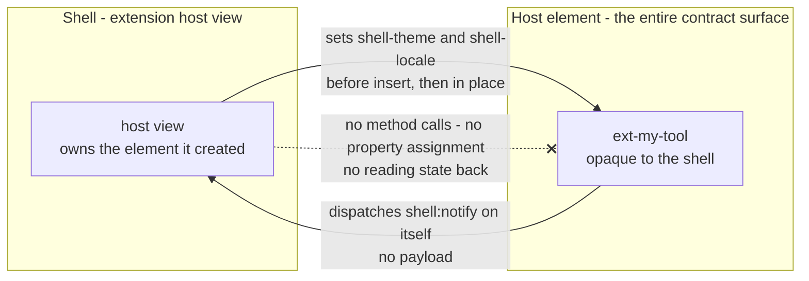
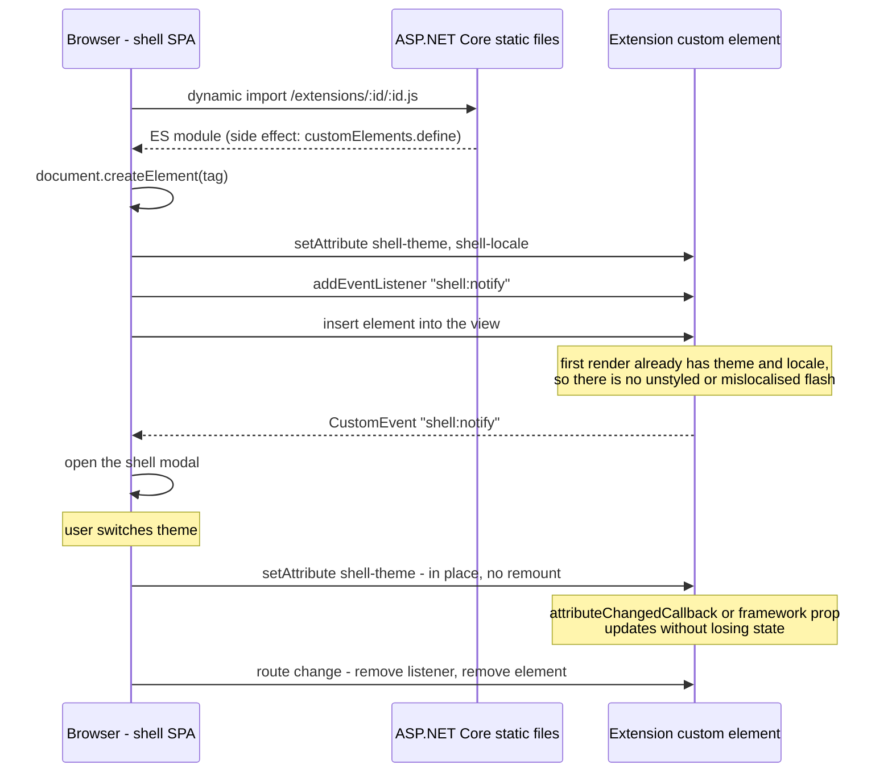

# 005 — Bidirectional Communication

Date: 2026-08-10
Related ADRs: [0006](../adr/0006-web-component-extension-system.md), [0008](../adr/0008-bidirectional-shell-extension-communication.md)
Related standards: [STD 001 v1.2.0](../standards/001-extension-consumption.md), [STD 002 v3.0.0](../standards/002-extension-authoring-and-communication.md)
Previous snapshot: [004](./004-extension-platform.md)

## What changed

Communication only. Discovery, build, packaging, the registry contract, delivery, and the development serving model are all unchanged from [snapshot 004](./004-extension-platform.md). The shell/extension channel was one-directional — extensions dispatched `CustomEvent`s and the shell passed nothing back. It is now bidirectional but asymmetric: extensions still send events, and the shell now writes **context attributes** onto the host element. Per ADR 0008 the initial inbound vocabulary is two attributes, `shell-theme` and `shell-locale`, carrying scalar strings.

The change is backward compatible and requires no extension changes. Honouring context attributes is optional, so an extension that has never heard of them keeps working; the two reference extensions are untouched.

## The contract surface

Both directions ride on the same element, which is what preserves the containment property that made the original one-way design attractive. The shell still cannot reach past the element it created, and an extension still cannot address anything but its own host. What changed is only that the element now has an inbound surface as well as an outbound one, and that surface is DOM attributes — the lowest-common-denominator mechanism, readable by any framework or none.

Attributes carry *state*, not *signals*, and that is the reason they were chosen over symmetric inbound events. An extension mounted after the last theme change would have missed an event and would need a request/response handshake to catch up; an attribute is simply always readable. Discrete inbound happenings, if they are ever needed, can be added later as an event vocabulary without conflicting with this decision.

## Mount and update sequence

The mount sequence gains one step. Snapshot 004's order was import → create → listen → insert; it is now import → create → **set attributes** → listen → insert. Attributes must land before insertion so the extension has its context at first render rather than after a visible correction. Updates afterwards are written in place on the mounted element — the shell never remounts, replaces, or re-imports an extension to deliver a changed value, which is what lets an extension hold user input across a theme switch.

## What did not change

The isolation guarantees are intact. Extensions still bundle their own framework with no externals or shared runtimes, still import nothing from the shell, and still cannot discover, address, or depend on each other — the shell remains the only party that knows the installed set. The registry's five fields, the manifest's three, the assembler's five validation gates, the layered image, and the two-value Helm change are all exactly as recorded in snapshot 004.

Change control is unchanged in kind, and now covers both directions equally: a new event, a payload, a third context attribute, a structured attribute value, or any additional channel requires a new accepted ADR before implementation (`CONSUMPTION-16`, `EXT-19`).

## Amendments to snapshot 004

Snapshot 004 is the self-contained platform reference and inlines normative text by design, so its communication section is amended in place to match STD 002 v3.0.0 rather than left to contradict it. Everything else in 004 stands. Snapshots 001, 002, and 003 are untouched history.
