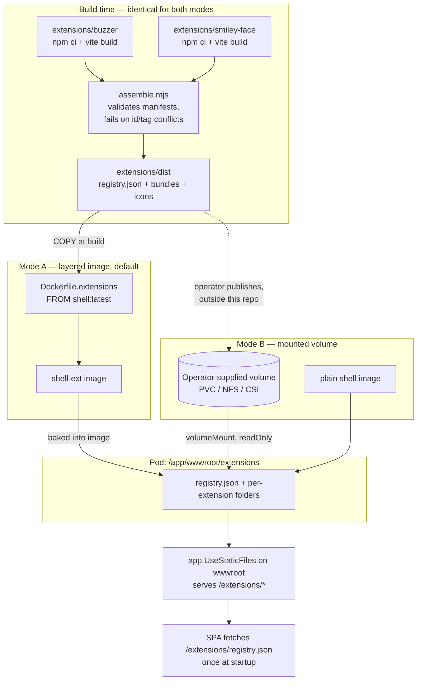

# 006 — Mounted Extension Delivery

Date: 2026-08-13
Related ADRs: [0006](../adr/0006-web-component-extension-system.md), [0007](../adr/0007-independent-extension-builds.md), [0009](../adr/0009-mounted-extension-volumes.md)
Previous snapshot: [005](./005-bidirectional-communication.md)

## What changed

Deployment only. The runtime flow, registry contract, discovery and lifecycle behaviour, context attributes, and the development serving model are all unchanged from [snapshot 005](./005-bidirectional-communication.md) and its predecessors.

What changed is that there is now more than one way to get extension assets into `wwwroot/extensions`. Previously the only route was a layered image built by `Dockerfile.extensions`. A second route now exists: mount an assembled dist over `/app/wwwroot/extensions` from a volume the operator supplies. The shell cannot tell the difference — in both cases it is serving static files out of `wwwroot` and fetching `/extensions/registry.json`.

Notably this required **no application change**. `Program.cs` already serves `wwwroot` statically, and kubelet creates the mount directory even though `/app/wwwroot/extensions` does not exist in the plain `shell` image. The change is entirely in the Helm chart.

## Both delivery paths



The left half of the diagram — everything up to `extensions/dist` — is shared. The registry is a build-time artifact in both modes; nothing assembles or merges one inside the cluster.

## Choosing a mode

| | Mode A — layered image | Mode B — mounted volume |
| --- | --- | --- |
| Artifact | `shell-ext` container image | A directory: `registry.json` + one folder per extension |
| Produced by | `docker build -f Dockerfile.extensions` | `node scripts/build-all.mjs`, published by the operator |
| Helm config | `image.repository` / `image.tag` | `extensions.enabled` + `extensions.volume` |
| Base image | `shell-ext` | plain `shell` |
| Release cadence | Coupled to an image build and push | Independent of the shell image |
| Validated by | CI, at image build time | Whoever populates the volume |
| Rollout to change extensions | New image tag → Deployment rollout | Depends on the volume; content is read per request |
| Default | Yes | Opt-in |

Mode A remains the default and the better choice when extensions and shell ship together, because a bad bundle fails in CI rather than in a pod. Mode B suits operators who already have a way to place files in a cluster and want extension releases decoupled from shell releases.

## The one hazard

The two modes are mutually exclusive, and combining them fails quietly. A volume mounted at `/app/wwwroot/extensions` covers whatever the image has at that path, so pairing a `shell-ext` image with a mounted volume serves the volume and makes the baked assets unreachable — no log line, no probe failure, no error in the UI. CONSUMPTION-15 forbids the combination and the chart's `NOTES.txt` warns about it, but nothing enforces it at deploy time.

Confirmed against the running images: `shell-ext` alone answers `/extensions/registry.json` with 200 and `ls /app/wwwroot/extensions` shows the baked `registry.json` and both extension folders; the same image with an empty volume mounted at that path answers 404 and the directory lists as empty. The baked files are still in the image layer — they are simply unreachable underneath the mount.

The related failure — an absent, empty, or malformed volume — is deliberately silent too, and that is by design rather than a hazard. A missing `registry.json` returns 404: `MapFallbackToFile` is registered with the `nonfile` route constraint, so a path whose last segment contains a dot bypasses the SPA fallback instead of being answered with `index.html` at 200. CONSUMPTION-07 requires every discovery failure — non-OK status included — to resolve to an empty list, and the content-type check of CONSUMPTION-06 is the second layer behind it for cases that *do* reach the fallback. Zero extensions has always been a normal state, so the shell starts and serves its built-in tools. Diagnosis is `kubectl exec deploy/<release> -- ls /app/wwwroot/extensions`.

Verified against the running image: with an empty directory mounted, `/extensions/registry.json` returns 404, `/healthz` returns `Healthy`, and the SPA still serves at 200.

## Chart surface

`helm/shell/values.yaml` gains an opt-in block, off by default:

```yaml
extensions:
  enabled: false
  volume: {}        # raw volume spec, passed through verbatim
  subPath: ""       # optional subdirectory within the volume

podSecurityContext: {}
# fsGroup is needed when the volume's files are root-owned, because the
# runtime image runs as the unprivileged `app` user.
```

`extensions.volume` is rendered with `toYaml` and never interpreted, so any volume type Kubernetes supports works without chart changes. That is what makes the local development story free: `helm/shell/examples/values-dev-hostpath.yaml` supplies a `hostPath` volume through the same passthrough, giving an in-cluster edit-rebuild loop with no chart code specific to it. Two mount sources, one code path.

Note that this is a *second*, separate development affordance. CONSUMPTION-03's `Extensions:RootPath` covers running the backend directly with `dotnet run`, where there is no pod; the hostPath mount covers running the shell in a local cluster. They do not overlap and neither replaces the other. The mount path is **not** a value — `/app/wwwroot/extensions` is the only path the image serves from, so exposing it would only allow a silently inert configuration. `deployment.yaml` fails the render outright when `enabled` is set without a volume, rather than producing a pod that starts and serves nothing.
