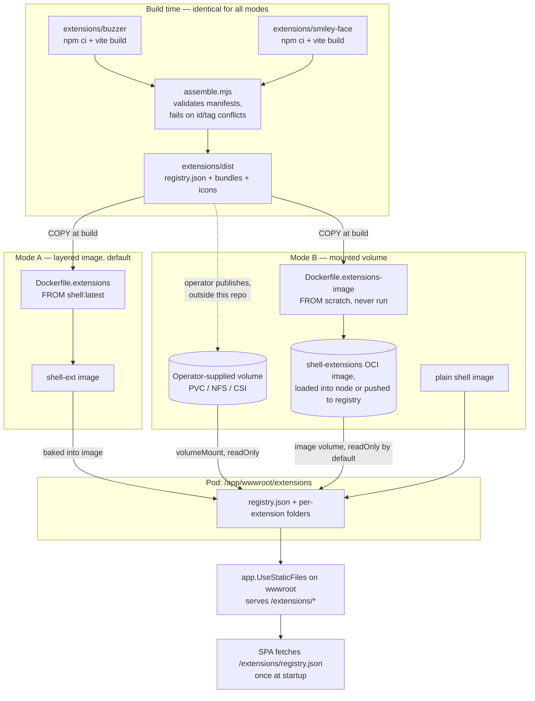

# 007 — Image Volume Extension Delivery

Date: 2026-08-17
Related ADRs: [0009](../adr/0009-mounted-extension-volumes.md), [0010](../adr/0010-image-volume-extension-delivery.md), [0011](../adr/0011-remove-hostpath-extension-delivery.md)
Previous snapshot: [006](./006-mounted-extension-delivery.md)

## What changed

Deployment only, again. The runtime flow, registry contract, discovery and lifecycle
behaviour, context attributes, and development serving model are all unchanged from
[snapshot 006](./006-mounted-extension-delivery.md) and its predecessors.

Snapshot 006 introduced Mode B (mounted volume) alongside Mode A (layered image) and
illustrated Mode B's chart-level genericness — "any volume type works" — with a hostPath
example for local development. That example did not hold up: Docker Desktop Kubernetes
and kind run the node as a container with no view of the host filesystem, so hostPath
failed on exactly the platforms the example targeted (`MountVolume.SetUp failed ...
hostPath type check failed: <path> is not a directory`, on every path convention tried).

What changed here is the example, not the architecture. Mode B still means "an assembled
dist, mounted read-only over `/app/wwwroot/extensions`, by whatever volume type the
operator supplies." The concrete recipe for local development and for build-artifact-
shaped delivery is now Kubernetes' `image` volume type (GA in 1.36) instead of hostPath.
`Dockerfile.extensions-image` packages `extensions/dist` as a standalone OCI image —
`FROM scratch`, never run as a container — which is either loaded directly into a local
node's containerd store or pushed to a registry for a shared cluster, exactly mirroring
how this chart already handles the `shell` image itself.

## Both delivery paths



The left half of the diagram — everything up to `extensions/dist` — is shared across all
three concrete recipes. The registry is a build-time artifact in every case; nothing
assembles or merges one inside the cluster.

## Choosing a mode

| | Mode A — layered image | Mode B — PVC | Mode B — image volume |
| --- | --- | --- | --- |
| Artifact | `shell-ext` container image | A directory: `registry.json` + one folder per extension | `shell-extensions` OCI image (never run) |
| Produced by | `docker build -f Dockerfile.extensions` | `node scripts/build-all.mjs`, published by the operator | `docker build -f Dockerfile.extensions-image` |
| Helm config | `image.repository` / `image.tag` | `extensions.enabled` + `extensions.volume.persistentVolumeClaim` | `extensions.enabled` + `extensions.volume.image` |
| Base image | `shell-ext` | plain `shell` | plain `shell` |
| Storage prerequisite | none | RWX-capable StorageClass | none — registry (shared) or node image load (local) |
| Local-dev friendly | Yes, but couples extension edits to a shell-ext rebuild | No — needs a populate job or manual sync | Yes — rebuild + reload, no filesystem coupling |
| Release cadence | Coupled to an image build and push | Independent of the shell image | Independent of the shell image |
| Read-only enforcement | N/A (baked in) | Chart-level (`readOnly: true` on the mount) | Volume-type-level, on by default |
| Minimum Kubernetes | any | any | 1.35+ (beta, on by default) or 1.36+ (GA) |
| Default | Yes | Opt-in | Opt-in |

Mode A remains the default and the better choice when extensions and shell ship
together, because a bad bundle fails in CI rather than in a pod. PVC suits operators who
already run RWX-capable storage and want a plain filesystem an existing pipeline can
write into. The image volume suits everyone else who wants Mode B's independent release
cadence without provisioning storage — including local development, which is why it
replaced the hostPath example (ADR 0011).

## The one hazard

Unchanged from snapshot 006: the modes are mutually exclusive, and combining Mode A with
either Mode B variant fails quietly, because a volume mounted at
`/app/wwwroot/extensions` shadows whatever the image has at that path. CONSUMPTION-15
forbids the combination; the chart's `NOTES.txt` warns about it; nothing enforces it at
deploy time. See snapshot 006 for the confirmed before/after behaviour — that evidence is
unaffected by this change.

## Chart surface

Unchanged from snapshot 006 — `extensions.volume` is still rendered with `toYaml` and
never interpreted:

```yaml
extensions:
  enabled: false
  volume: {}        # raw volume spec, passed through verbatim
  subPath: ""        # optional subdirectory within the volume
```

What changed is which example demonstrates the passthrough for local development.
Snapshot 006 pointed at `helm/shell/examples/values-dev-hostpath.yaml`; that file is
removed. `helm/shell/examples/values-dev-imagevolume.yaml` takes its place, supplying:

```yaml
extensions:
  volume:
    image:
      reference: shell-extensions:latest
      pullPolicy: Never   # or IfNotPresent/Always against a registry
```

Verified against a running Docker Desktop Kubernetes node (`desktop-control-plane`,
v1.36.1 / containerd 2.3.1): built `shell-extensions:latest`, loaded it into the node's
containerd image store with `docker save | ctr images import`, and the pod reached
`1/1 Running` with `registry.json` and both extension folders visible at
`/app/wwwroot/extensions` on the first attempt — no per-node filesystem workaround
required, unlike every hostPath path convention tried previously.
