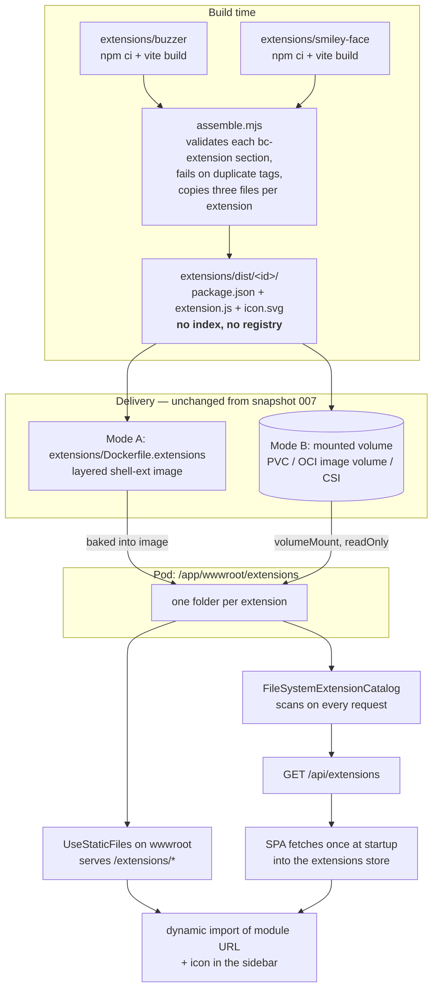
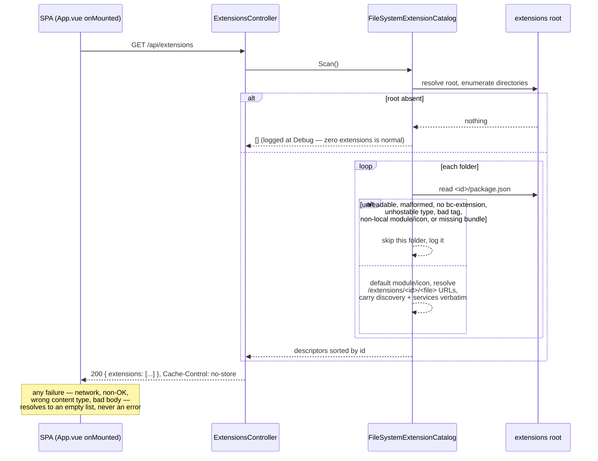

# 008 — Backend Extension Discovery

Date: 2026-08-18
Related ADRs: [0006](../adr/0006-web-component-extension-system.md), [0009](../adr/0009-mounted-extension-volumes.md), [0012](../adr/0012-filesystem-scanned-extension-discovery.md)
Previous snapshot: [007](./007-image-volume-extension-delivery.md)

## What changed

Discovery, and only discovery. Both delivery modes from
[snapshot 007](./007-image-volume-extension-delivery.md) are unchanged, as is everything
about how a mounted extension behaves once the shell has it: the mount sequence, context
attributes, the `shell:notify` channel, and teardown.

What changed is where the shell learns *what is installed*. It used to be
`registry.json` — a file merged at packaging time by `assemble.mjs` and fetched as a
static asset. That file is gone. **The contents of the extensions directory are now the
configuration**, and the shell reads them through a new backend endpoint,
`GET /api/extensions`, which enumerates the directory on every request.

Two pressures forced it. First, snapshots 006 and 007 turned
`/app/wwwroot/extensions` into a mount point — a directory a deployer populates and can
replace under a running pod. Describing that directory with a build-time artifact meant
the deployer had to produce a file only our assembler could legitimately generate, with
nothing checking that it matched the folders beside it. Second, extensions now describe
more than `{ id, name, tag }`: a `type`, the standards they implement and require, the
data services they depend on. That metadata belongs to the extension, and funnelling it
through a merged file meant every new field touched the assembler.

So the per-extension manifest moved into the extension's own `package.json`, under a
`bc-extension` key, and `extension.json` was deleted. Each built extension now ships
exactly three files, and the id is simply the folder name.

## Build and delivery

The two arrows out of the pod directory are the load-bearing detail: the catalog and the
static-file middleware read the *same* root, resolved once in `ExtensionsRoot.Resolve`. A
descriptor's `module` URL therefore cannot point somewhere the server does not serve.

## One discovery request

The per-folder `alt` is the point. A half-populated or partly corrupt volume degrades to
the extensions that are intact; it never blanks the sidebar and never returns a 500.

## What a descriptor carries

| Field | Source |
| --- | --- |
| `id` | the folder name — not a manifest field |
| `name`, `version` | `package.json` top-level |
| `displayName` | `bc-extension.displayName`, falling back to `name` |
| `type`, `tag` | `bc-extension` (required) |
| `module`, `icon` | `bc-extension`, defaulting to `extension.js` / `icon.svg`, resolved to `/extensions/<id>/<file>` |
| `discovery`, `services` | `bc-extension`, carried verbatim |

`discovery` and `services` are deliberately inert. The shell returns them and the store
holds them, but nothing gates a load on whether a requirement can be satisfied — that
needs the shell to declare what it provides and a version-matching rule, neither of which
exists yet. It gets its own ADR.

## Hazards

- **A mount still shadows baked extensions**, silently, exactly as in snapshot 006. Mount
  mode expects the plain `shell` image; nothing enforces it.
- **A stale folder is no longer inert.** This one is new. Under the registry, a leftover
  extension folder on a volume was unreachable because nothing referenced it. Now the
  folder *is* the configuration, so a removed-but-not-cleaned extension comes back in the
  sidebar at whatever version was last copied. Populate jobs must clear the target first —
  the example job's `rm -rf /target/*` went from hygiene to a requirement.
- **Discovery now costs filesystem I/O per request** — one enumeration plus a small read
  per extension. Deliberate, so a remount needs no restart, and bounded in practice by
  `no-store` plus the SPA fetching once per session. If the extension count ever reaches
  the hundreds, revisit with a watcher-invalidated cache rather than a naive one.
- **A tag typo is invisible to the build.** The assembler validates the manifest `tag` but
  cannot see what the bundle registers. The host view now checks `customElements.get(tag)`
  after import, so the failure is a visible error rather than a blank pane.
- **The shipped `package.json` is public**, at `/extensions/<id>/package.json`. The
  assembler trims it to `{ name, version, "bc-extension" }` for that reason.
