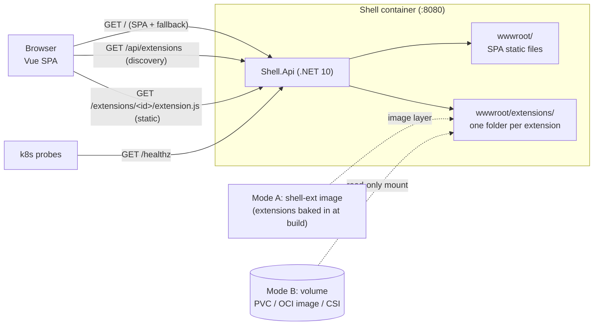
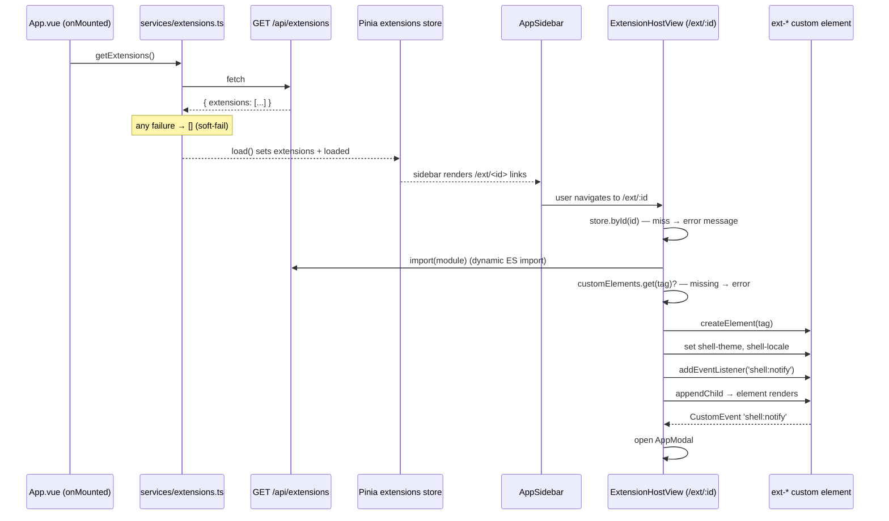
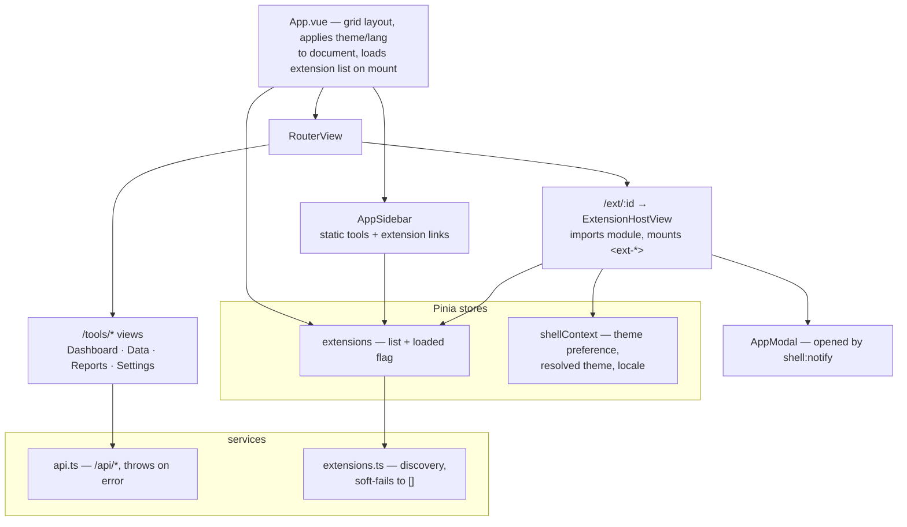

# 009 — Consolidated Architecture Overview

Date: 2026-08-18
Related ADRs: [0003](../adr/0003-single-container-serving.md), [0006](../adr/0006-web-component-extension-system.md), [0007](../adr/0007-independent-extension-builds.md), [0008](../adr/0008-bidirectional-communication.md), [0009](../adr/0009-mounted-extension-volumes.md), [0010](../adr/0010-oci-image-volumes.md), [0011](../adr/0011-remove-hostpath-example.md), [0012](../adr/0012-filesystem-scanned-extension-discovery.md)
Previous snapshot: [008](./008-backend-extension-discovery.md)

Unlike snapshots 001–008, this one is not a delta. It is a consolidated baseline: the whole
system as the code stands today, in one document. Where older ADRs disagree with the code
(see the appendix), the code wins.

## System at a glance

Shell is a single-service web app: a Vue 3 + Vite + TypeScript SPA and an ASP.NET Core
(.NET 10) API, served together from one container. The API serves the SPA as static files,
answers under `/api/*`, and exposes `/healthz` for probes.

Extensions are independently built **web components**. Each is a standalone npm package in
`extensions/<id>/` that compiles to a single self-contained ES module. At runtime, an
extension is just a folder of three files — `package.json`, `extension.js`, `icon.svg` —
sitting under the shell's `wwwroot/extensions/` directory. **The contents of that directory
are the configuration**: there is no registry file, no install step, no shell restart. The
shell rescans the directory on every discovery request.

## Runtime topology



One directory, two ways to fill it (see [Delivery](#packaging--delivery) below). Everything
downstream — discovery, static serving, the SPA — is identical in both modes.

## How the shell discovers extensions

### The directory contract

The extensions root is resolved once, by `ExtensionsRoot.Resolve` (shared by the discovery
scan and static-file serving, so the list and the assets can never disagree):

- Production: `<webroot>/extensions`, i.e. `/app/wwwroot/extensions` in the container.
- Development: `Extensions:RootPath` in `appsettings.Development.json` points at
  `extensions/dist`, so a local `node scripts/build-all.mjs` is immediately visible.

Inside the root, **each subdirectory is one extension and the folder name is its id**:

```
wwwroot/extensions/
├── buzzer/
│   ├── package.json      # name, version, and the "bc-extension" manifest
│   ├── extension.js      # self-contained ES module registering the custom element
│   └── icon.svg
└── smiley-face/
    └── ...
```

### The scan

`GET /api/extensions` (`Controllers/ExtensionsController.cs` →
`FileSystemExtensionCatalog.Scan()`) enumerates the root **on every request** and responds
with `Cache-Control: no-store` — a remounted volume shows up on the next call, no restart.
A missing root is not an error: the plain shell image ships with zero extensions, so the
endpoint returns `{"extensions":[]}`.

Per folder, the scanner walks a validation ladder. The posture is deliberately **lenient**:
one bad folder is skipped and logged, the rest are served.

| Check | On failure |
| --- | --- |
| Folder name matches `^[a-z0-9][a-z0-9._-]*$` | skipped |
| `package.json` exists and parses | skipped |
| `bc-extension` section present | skipped (folder isn't an extension) |
| `type` is `WebComponent` (case-insensitive) | skipped — not a type this shell can host |
| `tag` non-empty and starts with `ext-` | skipped |
| `module` / `icon` are plain file names — no `/`, `\`, `:`, `..` | skipped (traversal guard: the shell will dynamic-import this URL) |
| `module` file exists on disk | skipped — a listed bundle that 404s is a dead sidebar entry |
| `icon` file exists on disk | **still listed** — a broken icon is cosmetic |

Survivors are sorted by id (ordinal) and returned as camelCase JSON, with `module` and
`icon` already turned into absolute URLs:

```json
{
  "extensions": [
    {
      "id": "buzzer", "name": "ext-buzzer", "displayName": "Buzzer",
      "version": "1.0.0", "type": "WebComponent", "tag": "ext-buzzer",
      "module": "/extensions/buzzer/extension.js",
      "icon": "/extensions/buzzer/icon.svg",
      "discovery": { "implements": [], "requires": [] },
      "services": { }
    }
  ]
}
```

Defaults (`module` → `extension.js`, `icon` → `icon.svg`, `displayName` → package `name` →
folder id, `version` → `0.0.0`) are applied **by the shell**, not baked in at packaging
time — the shipped `package.json` carries the author's `bc-extension` section verbatim.

## How the SPA loads and mounts an extension



**Fetching is fail-soft by design** (ADR 0012). `services/api.ts` throws on errors;
extension discovery deliberately lives in `services/extensions.ts` instead, because
`App.vue` fires it from `onMounted` with nothing to catch a rejection. Network error,
non-JSON response (an older backend returns `index.html` at HTTP 200, so the content-type
is checked, not just the status), or a malformed body all collapse to an empty list — the
shell works, just without extensions.

**Routing is generic.** There is exactly one extension route, `/ext/:id` →
`ExtensionHostView`; routes are not generated per extension. An unknown id renders an error
message inside the view. The host view watches both the route param and the store's
`loaded` flag, so a hard refresh on `/ext/buzzer` mounts once the list arrives.

**Mounting order matters**: attributes before listeners before insertion, so context is in
place for the element's first render and no event dispatched during connection is missed.
Teardown (remove listener, remove element) runs on route change and unmount. Theme and
locale changes are applied **in place** via `setAttribute` — never a remount, so extension
state survives a theme toggle.

**The communication contract is intentionally tiny** (ADRs 0006/0008):

- Shell → extension: two attributes, `shell-theme` (`light`/`dark`, already resolved from
  the user's `system` preference) and `shell-locale`.
- Extension → shell: one `CustomEvent('shell:notify')`, no payload, dispatched on the host
  element (never `document`/`window`). The shell listens only on the element it created and
  responds by opening its modal.
- Extensions must not know about each other, and must not call `/api/extensions` — only the
  shell knows the installed set. Widening any of this requires a new ADR.

## Frontend structure



## The `bc-extension` manifest

An extension describes itself in a `bc-extension` section of its own `package.json` — there
is no `extension.json` and no registry. Full example (`extensions/buzzer/package.json`):

```json
{
  "name": "ext-buzzer",
  "version": "1.0.0",
  "bc-extension": {
    "type": "WebComponent",
    "displayName": "Buzzer",
    "tag": "ext-buzzer",
    "module": "extension.js",
    "icon": "icon.svg",
    "discovery": {
      "implements": [{ "name": "extensions-standard", "versions": ["1.1.1"] }],
      "requires": [{ "name": "DesignSystemStandard", "versions": ["1.1.1", "2.0.0"] }]
    },
    "services": {
      "Standards-DocumentViewerService": { "optional": false, "versions": ["2.0.0", "3.0.0"] }
    }
  }
}
```

The minimal valid manifest is three fields (`smiley-face` ships exactly this):
`{"type": "WebComponent", "displayName": "Smiley Face", "tag": "ext-smiley-face"}`.

| Field | What it is | What the shell does with it | Required | Default |
| --- | --- | --- | --- | --- |
| `type` | Extension kind | Gate: only `WebComponent` (case-insensitive) is hostable; anything else is skipped. Other types (e.g. iFrame) are anticipated but unsupported | **yes** | — |
| `tag` | Custom-element tag the bundle registers; must start with `ext-` | After importing the module, the shell verifies `customElements.get(tag)` succeeded, then `createElement(tag)` to mount | **yes** | — |
| `displayName` | Human-readable name | Sidebar label, error messages, notification modal | no | package `name`, else folder id |
| `module` | Bundle file name (plain file name only — no paths) | Becomes `/extensions/<id>/<module>`, dynamic-imported by the host view. File must exist or the extension is skipped | no | `extension.js` |
| `icon` | Icon file name (plain file name only) | Becomes `/extensions/<id>/<icon>`, rendered as `` in the sidebar. Missing file → still listed, broken image | no | `icon.svg` |
| `discovery.implements[]` | Capabilities this extension provides, as `{name, versions[]}` | Carried through to the API verbatim. **Not enforced** — advisory metadata | no | absent (`null` on the wire) |
| `discovery.requires[]` | Capabilities this extension expects the host to provide | Same — carried, not enforced; the shell mounts it regardless | no | absent |
| `services` | Map of service name → `{optional, versions[]}` the extension depends on | Carried verbatim, keys untouched. **Not enforced**. `optional` defaults `false`, `versions` defaults `[]` | no | absent (`null` on the wire) |

Not in `bc-extension`, by design: **`id`** is the folder name; **`name`** and **`version`**
are the top-level package fields (falling back to the folder id and `0.0.0`). Duplicating
them inside the section is a standards violation (STD 002).

## Authoring and build

Each extension is a standalone npm package with its own committed lockfile. It must build
in isolation (`npm ci && npm run build`), knows nothing about the shell's build or other
extensions, and bundles everything — including its own Vue runtime (~92 KB per bundle, zero
externals). Vite lib mode, ES format, single output file, and a
`process.env.NODE_ENV` define so the bundle runs in a browser. The entry's only side effect
is registration, guarded so repeat imports don't throw:

```ts
if (!customElements.get(TAG)) customElements.define(TAG, defineCustomElement(Buzzer))
```

The shell-owned scripts in `extensions/scripts/` produce the deployable set:

- `build-all.mjs` — discovers every folder with a `bc-extension` key, runs `npm ci` +
  `npm run build` in each, then assembles.
- `assemble.mjs` — validates each manifest (same rules as the backend scan) plus the one
  invariant only a whole-set view can check: **custom-element tags must be unique across
  the set** (ids are unique by construction — they're folder names). Then it copies exactly
  three files per extension into `extensions/dist/<id>/`, trimming the shipped
  `package.json` to `{name, version, bc-extension}` because it becomes publicly fetchable.

The two validators have opposite postures on purpose: **build time is strict** (the author
is present, fail loudly), **runtime is lenient** (the deployer isn't, serve what's valid).

## Packaging & delivery

Both modes end at the same place — `/app/wwwroot/extensions` — and everything after that
directory is identical. They are **mutually exclusive**: a mount silently shadows anything
baked into the image, so mount mode uses the plain `shell` image (which contains no
extensions at all).

### Mode A — layered image (default)

`extensions/Dockerfile.extensions` builds all extensions from source inside the image
(`node scripts/build-all.mjs`) and copies `dist/` onto the shell image:
`FROM shell:latest` + `COPY dist /app/wwwroot/extensions` → `shell-ext`.

### Mode B — mounted volume

Deploy the plain `shell` image and mount a volume holding an assembled dist over
`/app/wwwroot/extensions` (read-only). The Helm chart's opt-in `extensions` block passes
`extensions.volume` through **verbatim**, so any volume type works with no template change:

- **PVC** — populate with a job that must `rm -rf` the target first (a stale folder is
  served and listed). Needs `ReadWriteMany` when `replicaCount > 1`.
- **OCI image volume** — `extensions/Dockerfile.extensions-image` packages the dist as a
  `FROM scratch` image (never run; the kubelet unpacks it as a read-only volume). Needs a
  cluster with the k8s `image` volume type enabled.
- Anything else the cluster offers (NFS, CSI, ...).

No shell configuration is involved: the discovery endpoint reads whatever is at that path
on every request, so swapping the volume needs no restart.

### Trade-offs

| | Mode A: layered image | Mode B: mounted volume |
| --- | --- | --- |
| **Artifact** | One immutable image (`shell-ext`), shell + extensions tested and rolled out as a unit | Plain `shell` image + a separately managed volume |
| **Updating an extension** | Rebuild and redeploy the whole image | Repopulate the volume; live on the next discovery call, no pod restart |
| **Rollback** | Image tag — trivial and atomic | Depends on volume type: image volumes are versioned; a PVC is whatever was last written to it |
| **CI coverage** | Full — the served set is exactly what CI built | Volume contents are an operational surface outside CI's reach |
| **Per-environment sets** | One image per combination | One volume per environment, same image everywhere |
| **Failure modes** | Extension builds break the image build (loud, early) | Stale folders are served; a populate job that skips `rm -rf` leaves ghosts; a mount silently shadows a baked image; root-owned volumes need `fsGroup` for the unprivileged `app` user |

Rule of thumb: Mode A when extensions change at the shell's release cadence; Mode B when
extensions must change independently of shell deployments or differ per environment.

## Appendix — known-stale docs

The following older documents disagree with the code; this snapshot and the standards
(STD 001 v2.1.0, STD 002 v4.1.0) are current:

- **ADR 0009** and **ADR 0010** still describe `registry.json`, deleted by ADR 0012. The
  volume carries one folder per extension and nothing else — no index file.
- **Snapshot 002** describes a per-extension `extension.json`; the manifest is now the
  `bc-extension` section of `package.json`.
- **ADR 0010/0011** cite the Dockerfiles at the repo root; both moved to `extensions/`
  (commit `7e86e4f`). ADR 0010 also mentions a hostPath example removed by ADR 0011.
- The README's "three supported modes" counts volume types as modes; the normative framing
  (STD 001, used here) is **two modes** — layered image or mounted volume — with
  PVC/image/CSI as volume types within the second.
